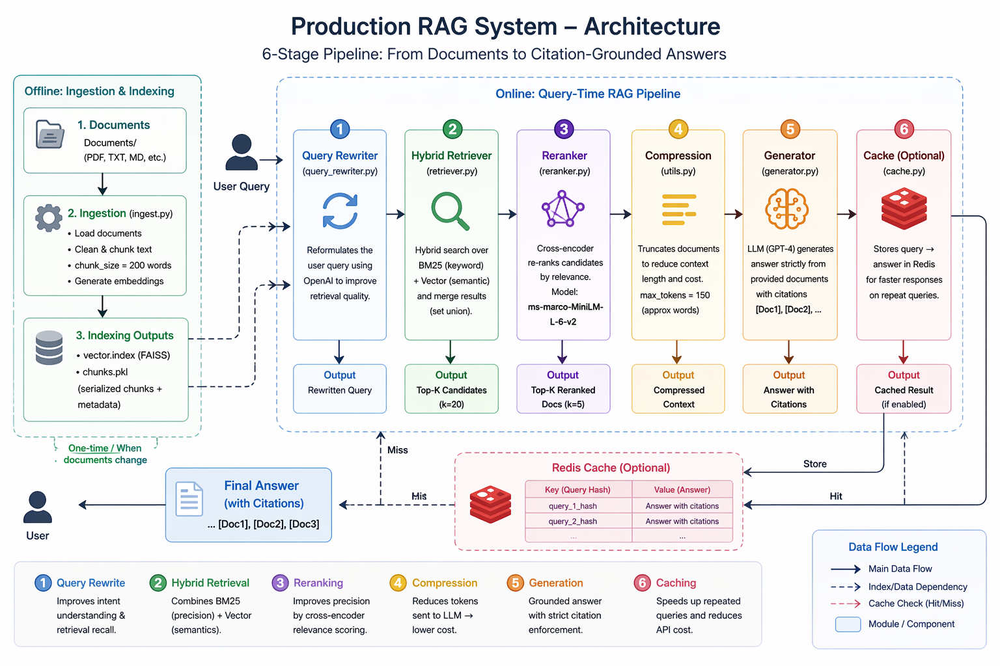

# 🚀 Production RAG System

A **production-grade Retrieval-Augmented Generation (RAG) pipeline** designed with industry best practices.
This system combines **hybrid retrieval, reranking, and grounded LLM generation** to deliver accurate, citation-backed answers.

---

## 📌 About

This project implements a **6-stage RAG pipeline** that enhances answer quality using:

* Query understanding & rewriting
* Hybrid search (semantic + keyword)
* Cross-encoder reranking
* Context compression
* LLM-based grounded generation
* Optional caching layer

It is designed to be **scalable and modular*, making it suitable for real-world applications like:

* Enterprise search systems
* Knowledge assistants
* Document Q&A platforms

---

## ✨ Features

* 🔍 **Hybrid Retrieval**

  * Combines **BM25 (keyword search)** + **FAISS (vector search)**

* 🧠 **Query Rewriting**

  * Improves retrieval using LLM-powered reformulation

* 🎯 **Reranking**

  * Uses cross-encoder (`ms-marco-MiniLM-L-6-v2`) for relevance scoring

* 📉 **Context Compression**

  * Reduces token usage for cost efficiency

* 🤖 **Grounded Generation**

  * Generates answers strictly from retrieved documents
  * Includes **citations** like `[Doc1], [Doc2]`

* ⚡ **Caching (Optional)**

  * Redis-based query → response caching

* 🏗️ **Modular Architecture**

  * Each stage is independently tunable

---

## 🛠️ Tech Stack

| Category       | Tools/Frameworks       |
| -------------- | ---------------------- |
| Language       | Python                 |
| Embeddings     | sentence-transformers  |
| Vector DB      | FAISS                  |
| Keyword Search | rank-bm25              |
| LLM            | OpenAI GPT             |
| Reranking      | Cross-Encoder (MiniLM) |
| Cache          | Redis                  |
| Config         | python-dotenv          |

---

## 📁 Project Structure

```
.
├── Documents/              # Input documents
├── ingest.py              # Document ingestion & indexing
├── rag_pipeline.py        # Main pipeline runner
├── query_rewriter.py      # Query rewriting module
├── retriever.py           # Hybrid retrieval logic
├── reranker.py            # Cross-encoder reranking
├── generator.py           # Answer generation (LLM)
├── utils.py               # Helper functions (compression)
├── cache.py               # Redis caching layer
├── vector.index           # FAISS index (generated)
├── chunks.pkl             # Serialized chunks (generated)
├── .env                   # API keys
```

---

## ⚙️ Installation

### 1. Clone the Repository

```bash
git clone https://github.com/YogeshwariBaviskar/production-rag-system.git
cd production-rag-system
```

### 2. Create Virtual Environment
python -m venv .venv

### 3. Install Dependencies
```bash
pip install sentence-transformers faiss-cpu rank-bm25 openai redis python-dotenv
```

### 4. Setup Environment Variables

Create a `.env` file:

```
OPENAI_API_KEY=your_api_key_here
```

### 4. Add Documents

Add files in Documents folder
---

## ▶️ Usage

### Run the Pipeline

```bash
python rag_pipeline.py
```

### Build / Rebuild Index

```bash
python ingest.py
```

---

## 🔄 How It Works

### Step-by-Step Flow

1. **User Query**
2. → Query is rewritten for better retrieval
3. → Hybrid search retrieves relevant documents
4. → Reranker selects top-k results
5. → Context is compressed
6. → LLM generates grounded answer with citations
7. → Result cached in Redis

---

## 🏗️ Architecture Diagram



---

## 🚀 Future Improvements

* Weighted hybrid retrieval scoring
* Streaming LLM responses
* Evaluation metrics dashboard

---